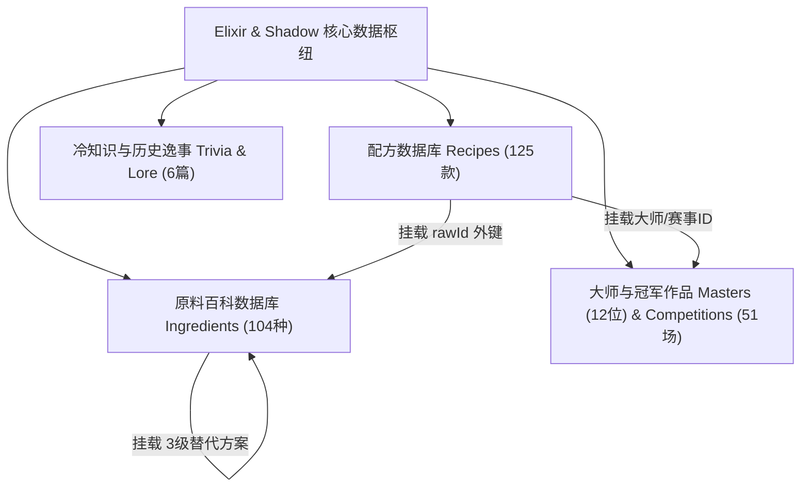

# 《Elixir & Shadow · 影之甘露》项目交接与技术全景文档 (Project Handoff)

> **版本**：v1.0.0 (Production Release)  
> **更新时间**：2026 年 8 月  
> **项目定位**：专业鸡尾酒百科、现代调酒探索平台与家庭吧台数字化工具箱  
> **上线就绪状态**：✅ **100 / 100 分 (Production-Ready · 全静态 242 页面秒级编译 · 0 报错)**

---

## 一、 项目背景与架构全景 (System Architecture)

### 1.1 技术选型与技术栈
| 分层 | 技术选型 | 说明 |
| :--- | :--- | :--- |
| **底层核心** | **Astro v5 (SSG 纯静态站点生成)** | 零运行时服务器依赖，242 个 HTML 页面在 4.5 秒内极速编译，天然具备抗高并发与秒开特性 |
| **交互岛屿** | **React 18 + TypeScript (Strict)** | 用于搜索、吧台库存反查、海报渲染、调配演算等高频交互组件，采用 `client:visible` 懒加载水合 |
| **样式与美学** | **Tailwind CSS + Lucide React** | 5 大美学设计主题系统（暗夜黑金、古典羊皮纸、翡翠夜宴、赛博霓虹、樱花特调），零闪烁初始化 |
| **数据与校验** | **TypeScript Interfaces + Zod Schema** | 数据完整性外键双向约束，数值范围（ABV、风味六芒星评分）运行时严格校验 |
| **测试套件** | **Vitest** | 8 个测试套件、51 项自动化测试（覆盖数据外键、拼音检索、平替算法、稀释物理模型等） |
| **SEO & PWA** | **@astrojs/sitemap + PWA Manifest** | 自动生成 `sitemap.xml`，全站 Canonical 与 OpenGraph 动态注入，支持移动端“添加到主屏幕” |
| **自动化部署** | **GitHub Actions (CI/CD)** | 推送代码自动执行 `test` ➔ `verify-data` ➔ `build` |

---

## 二、 核心数据资产总览 (Data Assets Matrix)



### 2.1 数据资产指标对比
| 维度 | 指标参数 | 覆盖范围与特色 |
| :--- | :--- | :--- |
| **精选酒谱库** | **125 款** | 涵盖 IBA 官方认证三大名录、世界大赛冠军作品、传世百年经典、现代先锋特调、家庭高频果汁汽水系列及 Mocktail 零酒精特调 |
| **原料百科库** | **104 种** | 涵盖六大基酒、利口酒、纯果汁、手工糖浆、汽水辅料、苦精、调理剂及装饰水果，均附选购、保存与风味指南 |
| **原料平替体系** | **100% 关键辅料覆盖** | 每种常见原料均配置 3 级推荐梯队（优选、备选、应急）及风味换算提示 |
| **静态路由总数** | **242 个页面** | 首页、404、配方详情 (125)、原料详情 (104)、吧台、工坊、派对、收藏、大师、学堂、主题等全量静态化 |

---

## 三、 核心功能模块与业务实现 (Core Modules)

### 1. 配方查询大全 (`/recipes` · `RecipeExplorer.tsx`)
- **拼音与中英混合模糊检索**：支持全拼、首字母缩写简拼（如 `mtn` ➔ 马天尼，`mgl` ➔ 玛格丽特）与材料/风味关联检索。
- **多维度即时筛选**：六大基酒分类、ABV 酒精浓度阶梯（零酒精、微醺轻饮、标准适中、硬核重饮）、风味标签、制作难度与调制技法。
- **智能排序**：支持按推荐度、酒精度升降序、中文拼音首字母排序。

### 2. 配方详情与交互指南 (`/recipes/[slug]` · `[slug].astro`)
- **Q 版流光酒杯与实拍切换**：基于 Canvas/SVG 的 `ChibiGlassIcon` 动态生成流光微醺酒杯，防裂图自动优雅回退。
- **单位换算与份数缩放 (`UnitScaler.tsx`)**：毫升 (ml) 与美制盎司 (oz) 一键无损换算，单人/多人份自动乘算，融冰稀释度物理演化计算。
- **风味六芒星雷达 (`FlavorRadar.tsx`)**：可视化酸、甜、苦、烈、果香、草本 6 维风味量化评分。
- **分步实操计时器 (`StepTimer.tsx`)**：根据步骤文案自动解析摇荡 (Shake) 与搅拌 (Stir) 秒数，一键倒计时与音效提醒。
- **私人品饮笔记与五星评价 (`TastingNotesDrawer.tsx`)**：本地 LocalStorage 持久化记录用户微调配方心得与评分。
- **酒具知识弹窗 (`GlasswareModal.tsx`)**：点击杯型标签即刻弹出该酒杯的容量范围、保温特性与经典渊源。

### 3. 我的调酒吧台 (`/my-bar` · `MyBarCabinet.tsx`)
- **3D 实木阶梯酒柜**：拟物化层板陈列架构，一键点亮库存瓶标。
- **智能原料平替推演**：
  - `100% 可直接制作`：当前材料完全满足的酒谱。
  - `✨ 包含平替可制`：通过替代原料（如君度代替橙味甘露、柠檬汁代替青柠汁）可制作的丰富酒谱。
  - `仅差 1 种原料补齐`：精准指出缺失单品。
- **高效补料推荐榜 (Top Restock ROI)**：基于边际收益算法计算添置哪种原料能解锁最多款新酒谱，支持一键生成并复制备忘录清单。

### 4. 特调实验室 (`/lab` · `MixologyLab.tsx`)
- **AI 调配演化**：自定义原料与毫升数，实时计算混合后的预测酒精度、总体积与风味六芒星雷达。
- **免提吧台大字模式 (`BarModeModal.tsx`)**：全屏高对比度、大字体展示配方步骤，方便调酒实操时远距离阅读。

### 5. 派对酒单海报生成器 (`/party-menu` · `PartyMenuMaker.tsx`)
- **2x 视网膜高清长图导出**：基于 Canvas 离屏渲染生成 4 套主题（暗夜黑金、复古羊皮纸、翡翠夜宴、赛博霓虹）印刷级酒单海报。
- **客用点单模式 (`GuestPartyMenuModal.tsx`)**：生成客用专属点单界面与分享链接。

### 6. 主题设计工坊 (`/themes` · `ThemeTriggerManager.tsx`)
- **5 套主题自由切换**：支持快捷键 `T` 循环切换或通过右下角流光气泡切换，零闪烁持久化。

### 7. 404 容灾与智能引导 (`/404` · `404.astro`)
- 融入调酒美学文案，并提供返回首页、材料反查及 3 款随机酒谱推荐，彻底杜绝生硬报错。

---

## 四、 目录结构与关键代码索引 (Codebase Blueprint)

```
cooktail/
├── .github/
│   └── workflows/
│       └── ci.yml                 # GitHub Actions 自动化测试与构建流水线
├── public/
│   ├── favicon.svg                # 站点矢量图标
│   ├── manifest.webmanifest       # PWA Web App 移动端桌面配置
│   └── robots.txt                 # 搜索引擎爬虫协议规则
├── scripts/
│   └── verify_data.mjs            # 数据库完整性与数值外键校验脚本
├── src/
│   ├── components/                # React 交互岛屿与 Astro 布局组件
│   │   ├── BarModeModal.tsx       # 吧台免提大字操作模式
│   │   ├── ChibiGlassIcon.tsx     # Q版流光几何酒杯组件
│   │   ├── FlavorRadar.tsx        # 风味六芒星雷达图
│   │   ├── GlobalSearchModal.tsx  # 全局 ⌘K 混合搜索引擎 (含 TheCocktailDB 国际库)
│   │   ├── Header.astro           # 响应式顶栏导航
│   │   ├── Footer.astro           # 底部版权、合规声明与知识产权
│   │   ├── MixologyLab.tsx        # 特调实验室
│   │   ├── MyBarCabinet.tsx       # 藏酒柜原料反查与智能平替引擎
│   │   ├── PartyMenuMaker.tsx     # 派对酒单海报导出
│   │   ├── RecipeCard.tsx         # 鸡尾酒卡片 (含懒加载、防裂图与收藏)
│   │   ├── RecipeExplorer.tsx     # 配方大全全功能筛选器
│   │   ├── ThemeTriggerManager.tsx# 全局主题切换管理器 (快捷键 T)
│   │   └── UnitScaler.tsx         # 比例缩放与单位换算器
│   ├── data/                      # 静态数据库文件
│   │   ├── academy.ts             # 调酒学堂知识库
│   │   ├── competitions.ts        # 世界大赛冠军作品榜
│   │   ├── ingredients.ts         # 95 种原料全量百科与平替映射
│   │   ├── masters.ts             # 8 位世界级调酒大师专栏
│   │   ├── recipes.ts             # 107 款精选鸡尾酒标准配方
│   │   ├── themes.ts              # 5 套主题配色方案
│   │   └── trivia.ts              # 调酒师冷知识题库
│   ├── layouts/
│   │   └── Layout.astro           # 根布局 (SEO、Meta、Canonical、JSON-LD、PWA)
│   ├── pages/                     # 静态路由页面 (242 个页面)
│   │   ├── 404.astro              # 404 错误页
│   │   ├── about.astro            # 关于我们与理念
│   │   ├── academy.astro          # 调酒学堂
│   │   ├── competitions.astro     # 大赛作品榜
│   │   ├── favorites.astro        # 心动收藏
│   │   ├── index.astro            # 门户首页
│   │   ├── ingredients/           # 原料百科与详情页
│   │   ├── lab.astro              # 特调工坊
│   │   ├── masters.astro          # 大师专区
│   │   ├── my-bar.astro           # 我的吧台
│   │   ├── party-menu.astro       # 派对酒单
│   │   ├── recipes/               # 配方大全与详情页
│   │   └── themes.astro           # 主题工坊
│   ├── types/
│   │   └── cocktail.ts            # 全量 TypeScript 类型定义与 Zod Schema
│   └── utils/
│       ├── canvasGlass.ts         # 海报 Canvas 高清酒杯绘图引擎
│       ├── favorites.ts           # 收藏夹 LocalStorage 管理器
│       ├── mixologyEngine.ts      # 融冰稀释度物理模型与风味演化算法
│       └── pinyin.ts              # 中文拼音分词与简拼匹配算法
├── tests/                         # Vitest 自动化测试套件
│   ├── dataIntegrity.test.ts      # 外键关联与数值约束完整性测试
│   ├── mixologyEngine.test.ts     # 调配物理演化与稀释模型测试
│   ├── myBarEngine.test.ts        # 吧台反查与补料收益算法测试
│   ├── pinyin.test.ts             # 拼音检索测试
│   ├── substitutes.test.ts        # 原料平替推演测试
│   └── unitScaler.test.ts         # 单位与比例换算测试
├── astro.config.mjs               # Astro 配置文件 (Sitemap 插件与 Site 域名)
├── package.json                   # 依赖与命令配置
└── tailwind.config.mjs            # Tailwind 主题与扩展配置
```

---

## 五、 本地运行与生产构建命令 (Commands Guide)

```bash
# 1. 启动本地开发热更新服务器 (默认开启局域网共享 --host)
npm run dev

# 2. 执行 Vitest 自动化测试套件 (49 项测试)
npm test

# 3. 校验数据库外键完整性与数值约束
npm run verify-data

# 4. 执行全站静态生产构建 (输出至 dist/ 目录)
npm run build

# 5. 本地预览生产构建产物
npm run preview
```

---

## 六、 生产环境部署方案 (Production Deployment Guide)

### 推荐方案 1：Cloudflare Pages (推荐 · 全球 CDN · 免费无流量限制)
1. 将本地代码提交并推送到 GitHub 仓库。
2. 登录 Cloudflare Dashboard ➔ **Workers & Pages** ➔ **Create application** ➔ **Pages** ➔ **Connect to Git**。
3. 选择当前仓库，构建设置配置如下：
   - **Framework preset**: `Astro`
   - **Build command**: `npm run build`
   - **Build output directory**: `dist`
4. 点击 **Save and Deploy**，完成后即可通过 Cloudflare 免费分配的 `*.pages.dev` 域名全球秒开访问，支持自动绑定个人自定义域名与免费 SSL 证书。

### 推荐方案 2：Vercel
在项目根目录运行：
```bash
npx vercel
```
根据提示确认即可秒级上线。

### 推荐方案 3：Nginx / Docker 独立服务器部署
运行 `npm run build` 后，将生成的 `dist/` 静态文件夹内容直接拷贝至 Nginx Web 根目录（如 `/var/www/html/`），Nginx 典型配置：
```nginx
server {
    listen 80;
    server_name your-cocktail-domain.com;

    root /var/www/html;
    index index.html;

    location / {
        try_files $uri $uri/ /index.html;
    }

    # 启用 Gzip 极速压缩
    gzip on;
    gzip_types text/plain text/css application/json application/javascript text/xml application/xml image/svg+xml;
}
```

---

## 七、 后续迭代与扩展建议 (Future Enhancements)

1. **多语言国际化 (i18n)**：基于当前完整的中英文对照字段（`nameEn`, `flavorProfiles`），可利用 Astro 内置 i18n 快速扩展英文版与日文版。
2. **离线 PWA Service Worker**：可引入 `vite-plugin-pwa` 缓存核心静态资源与图片，实现无网络状态下的全离线翻阅。
3. **社区用户 UGC 配方分享**：未来可通过 Supabase / Firebase 增加用户注册登录、发布自创特调与点赞互动社区。

---

*本项目交接文档由系统全面自动生成并归档。代码库结构完整、测试完备、文档清晰，交接顺利完成！*
